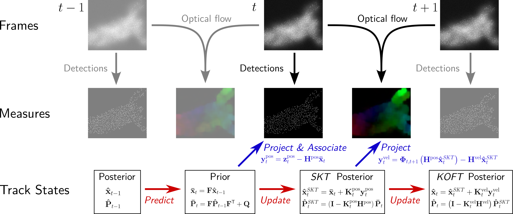

# Kalman and Optical Flow Tracking (KOFT)



Code for the [paper](https://ieeexplore.ieee.org/abstract/document/10635656): "Particle tracking in biological images with optical-flow enhanced Kalman filtering", published at IEEE ISBI2024.

Abstract:
*Single-particle-tracking is a fundamental pre-requisite for studying biological processes in time-lapse microscopy. However, it remains a challenging task in many applications where numerous particles are driven by fast and complex motion. To anticipate the  motion of particles most tracking algorithms usually assume near-constant position, velocity or acceleration of particles over consecutive frames. However, such assumptions are not robust to the large and sudden changes in velocity that typically occur in in vivo imaging. In this paper, we exploit optical flow to directly measure the velocity of particles in a Kalman filtering context. The resulting method shows improved robustness and correctly predicts particles positions, even with sudden motions. We validate our method on simulated data, in particular with high particle density and fast, elastic motions. We show that it divides tracking errors by two, when compared to other tracking algorithms, while preserving fast execution time.*

## Try KOFT on your data

KOFT is now implemented inside [ByoTrack](https://github.com/raphaelreme/byotrack) package. You can simply install byotrack with:

```bash
$ pip install byotrack torch-kf
```

Then you can run the KOFTLinker on your video & detections:

```python
import cv2
import numpy as np

import byotrack
import byotrack.visualize
from byotrack.implementation.linker.frame_by_frame.koft import KOFTLinker, KOFTLinkerParameters
from byotrack.implementation.optical_flow.opencv import OpenCVOpticalFlow

# Load your video:
video = byotrack.Video("path/to/my/video")

# Load your detections:
detections_sequence = ...

# Define the optical flow to use on your data
optflow = OpenCVOpticalFlow(cv2.FarnebackOpticalFlow_create(winSize=20), downscale=4)

# Check that the optical flow is set correctly (if it does not work properly, it may hurt tracking performances)
byotrack.visualize.InteractiveFlowVisualizer(video, optflow).run()

# Create the linker
specs = KOFTLinkerParameters(
    association_threshold=1e-3,  # Most important parameter: don't link if the association likelihood is smaller than 1e-3.
                                 # Higher values will increase fragmentation of the trajectories. Lower values will reduce
                                 # fragmentation but may increase identity switch.
                                 # Typical values are in [1e-5, 1e-2]
    detection_std=1.0,  # Detections precision in pixels (Usually ~ size of spots / 3)
    process_std=2.0,  # Motion prediction precision (Usually ~ unexpected displacement / 3)
    flow_std=1.0,  # Optical flow precision (Usually ~ max flow errors / 3)
    kalman_order=1,  # Order of the kalman filter (0: Brownian, 1: Directed, 2: Accelerated, ...)
    n_gap=5,  # Allow to link after 5 consecutive missed detections
)

linker = KOFTLinker(specs, optflow)

# Run the tracking
tracks = linker.run(video, detections_sequence)

# Visualize the tracks
byotrack.visualize.InteractiveVisualizer(video, detections_sequence, tracks).run()

# Export to Icy xml format:
import byotrack.icy
byotrack.icy.save_tracks(tracks, "tracks_koft.xml")
```

## Data


We rely on the [SINETRA](https://github.com/raphaelreme/SINETRA) synthetic datasets. It produces representative tracking data of fluorescence imaging of cells in freely-behaving animals.

Targets move according to elastic motions. The motions are either extracted from true fluorescence videos using optical flow (on the left) or produced from a physical-based simulation with springs (on the right).

The dataset can be generated with the code provided here. It relies on a fluorescence video of Hydra Vulgaris from Dupre C, et. al Non-overlapping Neural Networks in Hydra vulgaris. Curr Biol. 2017 Apr 24;27(8):1085-1097. doi: 10.1016/j.cub.2017.02.049. Epub 2017 Mar 30. PMID: 28366745; PMCID: PMC5423359. This video should be downloaded (see below).

We also use annnotated tracking data from the same paper. The video and ground truth tracks should also be downloaded. We provide a small script to download the dupre data and save it in `dataset/dupre` folder:

```bash
$ bash scripts/download_hydra_data.sh
```

## Reproduce the paper

### Complete installation

First clone the repository and submodules

```bash
$ git clone git@github.com:raphaelreme/koft.git
$ cd koft
$ git submodule init
$ git submodule update
```

We recommend using **uv** to benefit from the uv.lock and reproduce the exact python environment that we used.
In that case, [install uv](https://docs.astral.sh/uv/getting-started/installation/) and you can simply run the following command to duplicate our environment:

```bash
$ uv sync  # Will store the environment in ./.venv/ folder
```

Note that you can also use pip to directly install the project and its dependencies with:
```bash
$ pip install -e .  # Not recommended for result reproduction.
```

Additional requirements (Icy, Fiji) are needed to reproduce some results. See the installation guidelines of [ByoTrack](https://github.com/raphaelreme/byotrack) for a complete installation.

The experiment configuration files are using environment variables that needs to be set:
- $EXPERIMENT_DIR: Output folder of tracking experiments
- $DATA_FOLDER: Output folder of the simulation experiments
- $ICY: path to icy.jar
- $FIJI: path to fiji executable
- $RUN_KOFT_ENV: Prefix command to run inside the python env (if any). With **uv**, please set this to `uv run`.


### Dataset

We provide scripts to generate the same dataset that we used and run the same experiments

```bash
$ # First download the hydra data (if not already done)
$ bash scripts/download_hydra_data.sh
$
$ # Generate datasets for 5 differents seeds
$ bash scripts/generate_dataset.sh 111
$ bash scripts/generate_dataset.sh 222
$ bash scripts/generate_dataset.sh 333
$ bash scripts/generate_dataset.sh 444
$ bash scripts/generate_dataset.sh 555
```

These datasets will be stored in `./dataset/`

### Optical flow
You can reproduce our optical flow benchmark with:
```bash
$ bash scripts/flow.sh 111
$ bash scripts/flow.sh 222
$ bash scripts/flow.sh 333
$ bash scripts/flow.sh 444
$ bash scripts/flow.sh 555
```

Aggregating the results (mean +- std (N)) on the different seeds:

```bash
$ python scripts/aggregate_flow_results.py
```

### Tracking (SINETRA)
To reproduce our tracking results on SINETRA, run:
```bash
$ bash scripts/track_simulation.sh $method  # With method in (skt, koft--, koft, emht, trackmate-kf)
```

Aggregating the results (mean +- std (N)) on the different seeds:

```bash
$ python scripts/aggregate_results_simulation.py
```

### Tracking (Dupre's Hydra)
To reproduce our tracking results on Hydra vulgaris, run:
```bash
$ bash scripts/track_dupre.sh $method  # With method in (skt, koft--, koft, emht, trackmate-kf)
```

Aggregating the results (mean +- std (N)) on the different seeds:

```bash
$ python scripts/aggregate_results_dupre.py
```

### Noise robustness (SINETRA)
To reproduce our noise robustness analysis on SINETRA, run:
```bash
$ bash scripts/track_snr.sh $seed  # (111, 222, 333, 444, 555)
```

## Cite us


If you use this work, please cite our [paper](https://ieeexplore.ieee.org/abstract/document/10635656):

```bibtex
@INPROCEEDINGS{10635656koft,
  author={Reme, Raphael and Newson, Alasdair and Angelini, Elsa and Olivo-Marin, Jean-Christophe and Lagache, Thibault},
  booktitle={2024 IEEE International Symposium on Biomedical Imaging (ISBI)},
  title={Particle Tracking in Biological Images with Optical-Flow Enhanced Kalman Filtering},
  year={2024},
  volume={},
  number={},
  pages={1-5},
  keywords={Tracking;Filtering;Prediction algorithms;Particle measurements;Robustness;Kalman filters;Velocity measurement;Single-Particle-Tracking;Optical Flow;Kalman Filtering},
  doi={10.1109/ISBI56570.2024.10635656}
}
```
