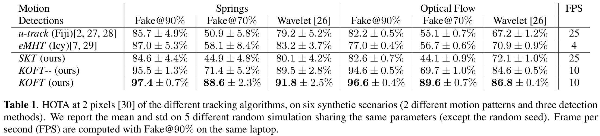

# Kalman and Optical Flow Tracking (KOFT)


Code for "Particle tracking in biological images with optical-flow enhanced Kalman filtering", submitted at ISBI2024.

Abstract:
*Single-particle-tracking is a fundamental pre-requisite for studying biological processes in time-lapse microscopy. However, it remains a challenging task in many applications where numerous particles are driven by fast and complex motion. To anticipate the  motion of particles most tracking algorithms usually assume near-constant position, velocity or acceleration of particles over consecutive frames. However, such assumptions are not robust to the large and sudden changes in velocity that typically occur in in vivo imaging. In this paper, we exploit optical flow to directly measure the velocity of particles in a Kalman filtering context. The resulting method shows improved robustness and correctly predicts particles positions, even with sudden motions. We validate our method on simulated data, in particular with high particle density and fast, elastic motions. We show that it divides tracking errors by two, when compared to other tracking algorithms, while preserving fast execution time.*

## Data


We simulate tracking data to validate our method. The goal of our simulator is to produce representative tracking data of fluorescence imaging of cells in freely-behaving animals.

Particles moves according to elastic motions. The motions are either extracted from true fluorescence videos using optical flow (on the left) or produced from a physical-based simulation with springs (on the right). 

Videos and ground truths used in the paper can be downloaded from https://partage.imt.fr/index.php/s/MHTpefDJWHp2HRD or reproduced with the code provided here.


## Install

First clone the repository and submodules

```bash
$ git clone git@github.com:raphaelreme/koft.git
$ cd koft
$ git submodule init
$ git submodule update
```

Install requirements

```bash
$ pip install -r requirements.txt
```

Additional requirements (Icy, Fiji) are needed to reproduce some results. See the installation guidelines of [ByoTrack](https://github.com/raphaelreme/byotrack) for a complete installation.

The experiment configuration files are using environment variables that needs to be set:
- $EXPERIMENT_DIR  (Output folder of tracking experiments)
- $DATA_FOLDER (Output folder of the simulation experiments)
- $ICY (path to icy.jar)
- $FIJI (path to fiji executable)

## Reproduce

We provide scripts to generate the same dataset that we used and run the same experiments

```bash
$ # Generate dataset for 5 differents seeds
$ bash scripts/generate_paper_dataset.sh 111
$ bash scripts/generate_paper_dataset.sh 222
$ bash scripts/generate_paper_dataset.sh 333
$ bash scripts/generate_paper_dataset.sh 444
$ bash scripts/generate_paper_dataset.sh 555
```

Reproducing the results for a particular method (skt, koft--, koft, koft++, emht, trackmate):

```bash
$ bash scripts/eval.sh $method  # With method in skt, koft, etc..
```

Aggregating all the results (mean +- std) on the different seeds:

```bash
$ python scripts/aggregate_results.py
```

## Results


